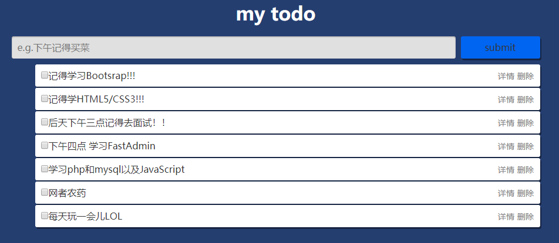
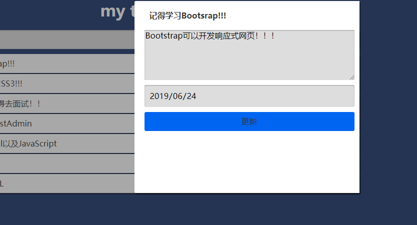

# mytodo
练习jquery,一个jquery todo 项目,尝试使用npm管理项目依赖。

## 使用插件
* [store.js](https://github.com/marcuswestin/store.js)管理localStorage
* [normalize.css](https://github.com/necolas/normalize.css)

## 项目展示

### 主页

### 项目更新

